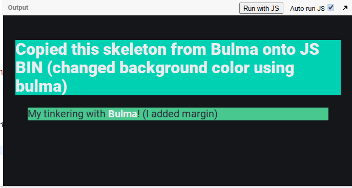

# Entry 4
##### 3/15/26

## Content
Following the completion of the class choosing their designated tools to tinker with for their freedom project, the class is now confirming their choices through a blog entry. The tool that I chose to handle Bulma, the responsive css framework that is based off Flexbox and is also open sourced. The reason why I chose to work with Bulma is due to Bulma not being overextensively difficult to handle and is organized. Bulma is also only coded in css, making me already familiar to how the syntax is going to operate.

Similar to Bootstrap, Bulma is able to make columns and containers.
### How I tinkered with it:
```html
<div class="columns">
  <div class="column is-one-third">one-third</div>
  <div class="column">code boi</div>
  <div class="column">code boi</div>
</div>
```
I tried the syntax out on my IDE. Similar to Bootstrap, Bulma works in a container of a 12 grid system, meaning I can add 12 columns that adjusts accordingly to how many columns I place. And in the code, the size adjusts based off `is-three-quarters` `is-two-thirds` `is-half` `is-one-third` `is-one-quarter` `is-full`.




[Previous](entry03.md) | [Next](entry05.md)

[Home](../README.md)
